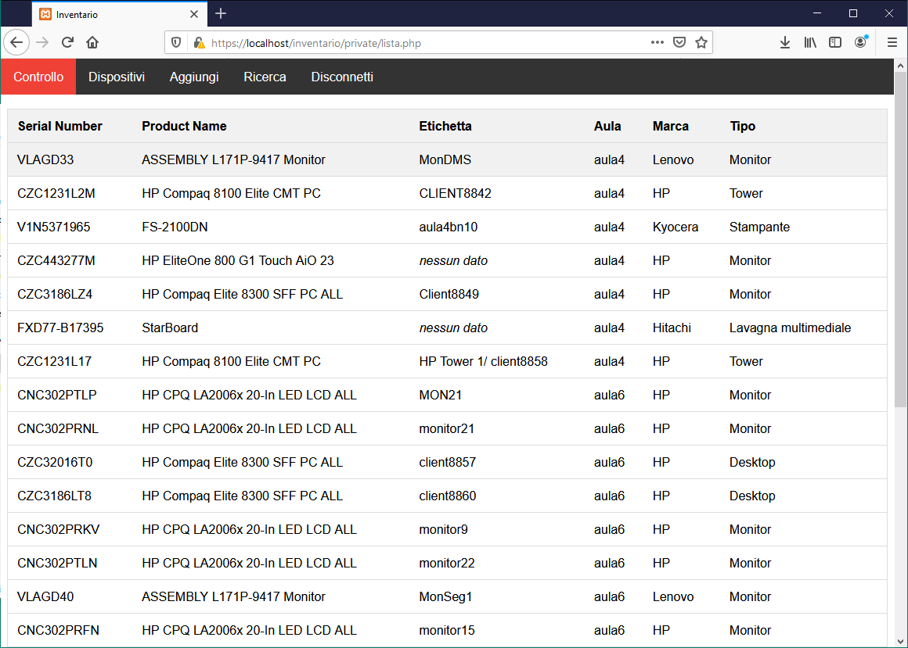

# Inventory
Website for the management of inventory devices for companies with QR-Code generator for the periodically controlling of the devices

## Table of contents
* [General Info](#general-info)
* [Screenshots](#screenshots)
* [Setup](#setup)
* [Features](#features)
* [Dependencies](#Dependencies)
* [Tested On](#tested-on)

## General Info
This inventory managment software allow users or companies to organize their devices. The partucularity of this software is the possibility to set a time period for each device. When the time period expires the device will apper in a particular list containig all the devices "expired". You can remove the devices from this list by scanning the QR code. This is particularly useful if you need to check the integrity of your company's devices periodically.

## Screenshots

  

 
 
## Setup
Inizialize database:
1. create a database named: "nren_inventario"
1. import into the database /db/schema.sql

* rename "web" folder in  "inventario" (the site should be accessed by http://<domain>/inventario)
* the default password is: **admin123Inv**

## Features
* organize devices
* list for devices to check
* QR-code generator
* export-import CSV
* advanced search for device

## Dependencies
This software utilizes the following dependencies, this dependencis are already included in the project.
* jQuery 3.2.1
* QR Codes (*from [googleapi](https://developers.google.com/chart/infographics/docs/qr_codes)*)

## Tested On
This software was tested with the following software, I can't guarantee the correct for other versions.
* Apache 2.4.23
* PHP 5.5.38
* 10.1.19-MariaDB

License
----

MPL-2.0 © Samuel Martins

